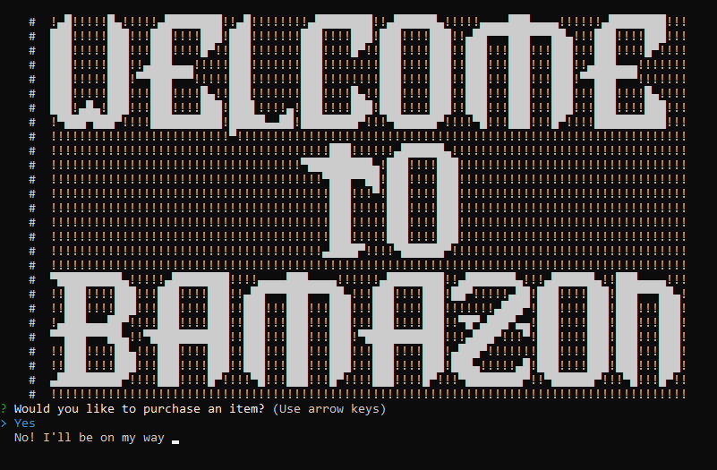
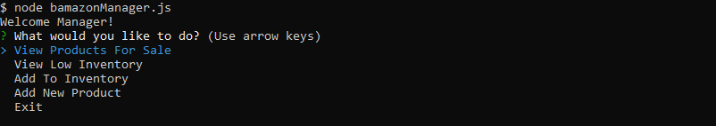

># bamazon
Bamazon: Node &amp; mySQL

## Bamazon is a node application allowing the addition and change of information within the provided mySQL database. In an interesting and fun way shows the dynamic ways you are able to manipulate databases through use of node.js

### Within the repository are two separate js files. Each with different functions.

>### bamazonCustomer.js being the lowest level functionality, limited to:
>- Prompts user option to shop or exit
>- Reads database table and displays contents
>- Prompts user for choice of products, and amount to purchase
>- Display total cost of transaction
>- Offers restart or exit options

>### bamazonManager.js a different, slightly more in depth application capable of:
>- Prompts the user with a four option menu, five including exit
>- View Products On Sale - Displays all products in the table
>- View Low Inventory - Displays products from the table with stock less than 10
>- Add To Inventory - Allows user to increase an items stock of their choosing
>- Add New Product - Takes in through user input, all fields for a new product, and inserts it into the table
>- Exit - Self explanatory, exits the program

### Each file has it's unique welcome screen, and easy to navigate menus

>## bamazonCustomer.js
>

>## bamazonManager.js (A little less flashy)
>

>## [Link to bamazonCustomer.js in action](https://drive.google.com/file/d/1HrrD7QZIrwdan0OE_4wBEC_XZ-YjfFUD/view)

>## [Link to bamazonManager.js in action](https://drive.google.com/file/d/1W20BMWih5vmTWMG8ZRLmGF1e4qRumsMN/view)
